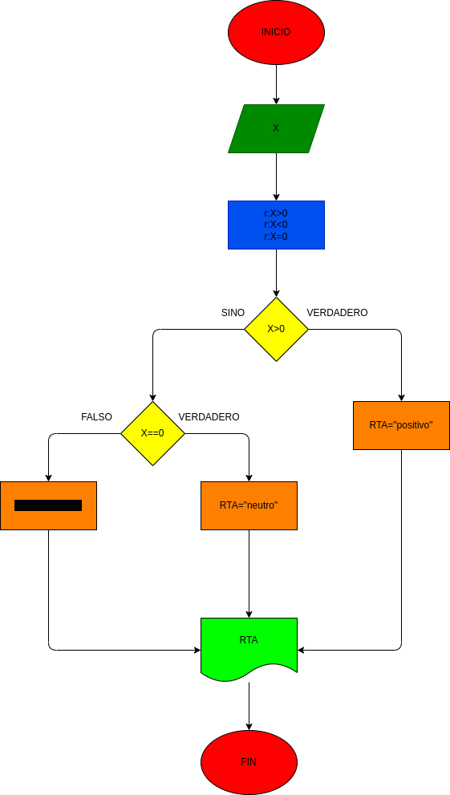

# EJERCICIO NO. 5

programa para identificar si un numero es positivo o negativo

# ANALISIS

Variable de entrada(input)

X=un numero 

variables de proceso y salida (processing, storage, output)

rta=nos va a decir si es positivo o negativo

# DISEÑO

# CONSTRUCCION